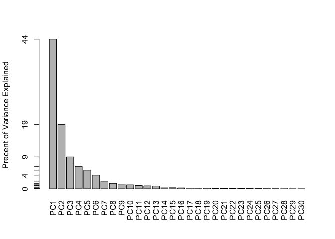

lac9 Hands-on
================
mac
Thu Nov 1 11:51:18 2018

this is \*\* regular text\*\*

``` r
# above command: ake .r become .rmd (?)
# lec_9_hands-on

# 1. import data and convert data.fame to matrix
wisc.df <- read.csv('WisconsinCancer.csv')

str(wisc.df) # review structure
```

    ## 'data.frame':    569 obs. of  33 variables:
    ##  $ id                     : int  842302 842517 84300903 84348301 84358402 843786 844359 84458202 844981 84501001 ...
    ##  $ diagnosis              : Factor w/ 2 levels "B","M": 2 2 2 2 2 2 2 2 2 2 ...
    ##  $ radius_mean            : num  18 20.6 19.7 11.4 20.3 ...
    ##  $ texture_mean           : num  10.4 17.8 21.2 20.4 14.3 ...
    ##  $ perimeter_mean         : num  122.8 132.9 130 77.6 135.1 ...
    ##  $ area_mean              : num  1001 1326 1203 386 1297 ...
    ##  $ smoothness_mean        : num  0.1184 0.0847 0.1096 0.1425 0.1003 ...
    ##  $ compactness_mean       : num  0.2776 0.0786 0.1599 0.2839 0.1328 ...
    ##  $ concavity_mean         : num  0.3001 0.0869 0.1974 0.2414 0.198 ...
    ##  $ concave.points_mean    : num  0.1471 0.0702 0.1279 0.1052 0.1043 ...
    ##  $ symmetry_mean          : num  0.242 0.181 0.207 0.26 0.181 ...
    ##  $ fractal_dimension_mean : num  0.0787 0.0567 0.06 0.0974 0.0588 ...
    ##  $ radius_se              : num  1.095 0.543 0.746 0.496 0.757 ...
    ##  $ texture_se             : num  0.905 0.734 0.787 1.156 0.781 ...
    ##  $ perimeter_se           : num  8.59 3.4 4.58 3.44 5.44 ...
    ##  $ area_se                : num  153.4 74.1 94 27.2 94.4 ...
    ##  $ smoothness_se          : num  0.0064 0.00522 0.00615 0.00911 0.01149 ...
    ##  $ compactness_se         : num  0.049 0.0131 0.0401 0.0746 0.0246 ...
    ##  $ concavity_se           : num  0.0537 0.0186 0.0383 0.0566 0.0569 ...
    ##  $ concave.points_se      : num  0.0159 0.0134 0.0206 0.0187 0.0188 ...
    ##  $ symmetry_se            : num  0.03 0.0139 0.0225 0.0596 0.0176 ...
    ##  $ fractal_dimension_se   : num  0.00619 0.00353 0.00457 0.00921 0.00511 ...
    ##  $ radius_worst           : num  25.4 25 23.6 14.9 22.5 ...
    ##  $ texture_worst          : num  17.3 23.4 25.5 26.5 16.7 ...
    ##  $ perimeter_worst        : num  184.6 158.8 152.5 98.9 152.2 ...
    ##  $ area_worst             : num  2019 1956 1709 568 1575 ...
    ##  $ smoothness_worst       : num  0.162 0.124 0.144 0.21 0.137 ...
    ##  $ compactness_worst      : num  0.666 0.187 0.424 0.866 0.205 ...
    ##  $ concavity_worst        : num  0.712 0.242 0.45 0.687 0.4 ...
    ##  $ concave.points_worst   : num  0.265 0.186 0.243 0.258 0.163 ...
    ##  $ symmetry_worst         : num  0.46 0.275 0.361 0.664 0.236 ...
    ##  $ fractal_dimension_worst: num  0.1189 0.089 0.0876 0.173 0.0768 ...
    ##  $ X                      : logi  NA NA NA NA NA NA ...

``` r
wisc.data <- as.matrix(wisc.df[,3:32],dimnames = wisc.df$id)
rownames(wisc.data) <- wisc.df$id

# Exploratory data analysis
# Q1. How many observations are in this dataset?
dim(wisc.data)
```

    ## [1] 569  30

``` r
# Q2. How many variables/features in the data are suffixed with _mean?
a = length(grep('_mean',colnames(wisc.df),value = F))
# there are a # of mean values in the report

# Q3. How many of the observations have a malignant diagnosis?
diagnosis <- wisc.df$diagnosis=='M'
table(wisc.df$diagnosis)
```

    ## 
    ##   B   M 
    ## 357 212

``` r
# Section 2.
# Performing PCA

colMeans(wisc.data) 
```

    ##             radius_mean            texture_mean          perimeter_mean 
    ##            1.412729e+01            1.928965e+01            9.196903e+01 
    ##               area_mean         smoothness_mean        compactness_mean 
    ##            6.548891e+02            9.636028e-02            1.043410e-01 
    ##          concavity_mean     concave.points_mean           symmetry_mean 
    ##            8.879932e-02            4.891915e-02            1.811619e-01 
    ##  fractal_dimension_mean               radius_se              texture_se 
    ##            6.279761e-02            4.051721e-01            1.216853e+00 
    ##            perimeter_se                 area_se           smoothness_se 
    ##            2.866059e+00            4.033708e+01            7.040979e-03 
    ##          compactness_se            concavity_se       concave.points_se 
    ##            2.547814e-02            3.189372e-02            1.179614e-02 
    ##             symmetry_se    fractal_dimension_se            radius_worst 
    ##            2.054230e-02            3.794904e-03            1.626919e+01 
    ##           texture_worst         perimeter_worst              area_worst 
    ##            2.567722e+01            1.072612e+02            8.805831e+02 
    ##        smoothness_worst       compactness_worst         concavity_worst 
    ##            1.323686e-01            2.542650e-01            2.721885e-01 
    ##    concave.points_worst          symmetry_worst fractal_dimension_worst 
    ##            1.146062e-01            2.900756e-01            8.394582e-02

``` r
apply(wisc.data,2,sd)
```

    ##             radius_mean            texture_mean          perimeter_mean 
    ##            3.524049e+00            4.301036e+00            2.429898e+01 
    ##               area_mean         smoothness_mean        compactness_mean 
    ##            3.519141e+02            1.406413e-02            5.281276e-02 
    ##          concavity_mean     concave.points_mean           symmetry_mean 
    ##            7.971981e-02            3.880284e-02            2.741428e-02 
    ##  fractal_dimension_mean               radius_se              texture_se 
    ##            7.060363e-03            2.773127e-01            5.516484e-01 
    ##            perimeter_se                 area_se           smoothness_se 
    ##            2.021855e+00            4.549101e+01            3.002518e-03 
    ##          compactness_se            concavity_se       concave.points_se 
    ##            1.790818e-02            3.018606e-02            6.170285e-03 
    ##             symmetry_se    fractal_dimension_se            radius_worst 
    ##            8.266372e-03            2.646071e-03            4.833242e+00 
    ##           texture_worst         perimeter_worst              area_worst 
    ##            6.146258e+00            3.360254e+01            5.693570e+02 
    ##        smoothness_worst       compactness_worst         concavity_worst 
    ##            2.283243e-02            1.573365e-01            2.086243e-01 
    ##    concave.points_worst          symmetry_worst fractal_dimension_worst 
    ##            6.573234e-02            6.186747e-02            1.806127e-02

``` r
scaled_wisc.data <- scale(wisc.data)

# standarize wisc.data for difference between Observ high sd and mean 
library('stats')
wisc.pr <- prcomp(scaled_wisc.data)

PCA_wisc <- summary(wisc.pr) # ??????

# Q4. From your results, what proportion of the original variance is 
#captured by the first principal components (PC1)?
PCA_wisc$importance[2,1] #get the proportion of variance from actual summary table
```

    ## [1] 0.44272

``` r
# Q5. How many principal components (PCs) are required to describe at
#least 70% of the original variance in the data?
cum_PCA_wisc70up <- PCA_wisc$importance[3,]>0.7
# idx_wisc70up <- PCA_wisc$importanc[cum_PCA_wisc70up]
length(PCA_wisc$importance[3,])-sum(PCA_wisc$importance[3,]>=0.7)+1
```

    ## [1] 3

``` r
# Q6. How many principal components (PCs) are required to describe at
#least 90% of the original variance in the data?
length(PCA_wisc$importance[3,])-sum(PCA_wisc$importance[3,]>=0.9)+1
```

    ## [1] 7

``` r
# Create a biplot of the wisc.pr using the biplot() function.
# Q7. What stands out to you about this plot? Is it easy or difficult to understand? Why?
biplot(wisc.pr,scale = T)
```


``` r
# hard to see anything
attributes(wisc.pr) # find dollars
```

    ## $names
    ## [1] "sdev"     "rotation" "center"   "scale"    "x"       
    ## 
    ## $class
    ## [1] "prcomp"

``` r
dim(wisc.pr$x)
```

    ## [1] 569  30

``` r
#plot PC1 vs PC2
plot(wisc.pr$x[,1],wisc.pr$x[,2],xlab = "PC1", ylab = "PC2",col=diagnosis+1)
```


``` r
palette() #check which color is Malign and bad
```

    ## [1] "black"   "red"     "green3"  "blue"    "cyan"    "magenta" "yellow" 
    ## [8] "gray"

``` r
# Q8. Repeat the same for principal components 1 and 3. What do you notice about these plots?
# smaller
plot(wisc.pr$x[, c(1, 3)], col = (diagnosis + 1), 
     xlab = "PC1", ylab = "PC3")
```


``` r
pr.var <- wisc.pr$sdev^2 # Calculate the variance of each principal component
pve <- pr.var/sum(pr.var) #Calculate the variance explained by each principal 
# component by dividing by the total variance explained of all principal components.
plot(pve,xlab = "Principal Component", 
     ylab = "Proportion of Variance Explained", 
     ylim = c(0, 1), type = "o")
```


``` r
barplot(pve, ylab = "Precent of Variance Explained",
        names.arg=paste0("PC",1:length(pve)), las=2, axes = FALSE)
axis(2, at=pve, labels=round(pve,2)*100 ) #exibit only useful y-axis data
```



``` r
# cumsum()
plot(cumsum(pve),xlab = "Principal Component", 
     ylab = "Proportion of Variance Explained", 
     ylim = c(0, 1), type = "o")
```


``` r
#above: judge how well PCA doing

# Q9. For the first principal component, what is the component of 
# the loading vector (i.e. wisc.pr$rotation[,1]) for the feature concave.points_mean?
# concave.points_mean


# Q10. What is the minimum number of principal components required to explain 80% of 
# the variance of the data?

# 3. cluster using PCA result

data.scaled <- scale(wisc.data)
data.dist <- dist(data.scaled)
wisc.hclust <- hclust(d = data.dist)

# Q11. Using the plot() function, what is the height at which the clustering model
# has 4 clusters?

plot(wisc.hclust)
```


``` r
wisc.hclust.clusters <- cutree(wisc.hclust,k = 4) #assign data to four clusters
table(wisc.hclust.clusters,diagnosis) 
```

    ##                     diagnosis
    ## wisc.hclust.clusters FALSE TRUE
    ##                    1    12  165
    ##                    2     2    5
    ##                    3   343   40
    ##                    4     0    2

``` r
# Q12. Can you find a better cluster vs diagnoses match with by cutting into a 
# different number of clusters between 2 and 10?

wisc.hclust.clusters <- cutree(wisc.hclust,k = 4) #assign data to four clusters
table(wisc.hclust.clusters,diagnosis) # compare result with diagnosis
```

    ##                     diagnosis
    ## wisc.hclust.clusters FALSE TRUE
    ##                    1    12  165
    ##                    2     2    5
    ##                    3   343   40
    ##                    4     0    2

``` r
#Section 4.
# K-means clustering and comparing results


# wisc.km <- kmeans(wisc.data, centers= ___, nstart= ___)


# Section 5.
# Clustering on PCA results
# use our model to persict

## Use the distance along the first 7 PCs for clustering i.e. wisc.pr$x[, 1:7]
# need distance 
d.pr <- dist(wisc.pr$x[,1:7]) #use only PCs explaining 90%
wisc.pr.hclust <- hclust(d.pr, method='complete')
plot(wisc.pr.hclust)
```


``` r
# Q14. How well does the newly created model with four clusters separate out the two diagnoses?
wisc.hclust.clusters2 <- cutree(wisc.pr.hclust,k = 4) #assign data to four clusters
table(wisc.hclust.clusters,diagnosis) 
```

    ##                     diagnosis
    ## wisc.hclust.clusters FALSE TRUE
    ##                    1    12  165
    ##                    2     2    5
    ##                    3   343   40
    ##                    4     0    2

``` r
table(wisc.hclust.clusters2,diagnosis) # I think the second is even more noisy...?
```

    ##                      diagnosis
    ## wisc.hclust.clusters2 FALSE TRUE
    ##                     1     5  113
    ##                     2   350   97
    ##                     3     2    0
    ##                     4     0    2

``` r
# Section 6.


### perdictive modeling with PCA components

## Predicting Malignancy Of New samples
url <- "https://tinyurl.com/new-samples-CSV"
new <- read.csv(url)
npc <- predict(wisc.pr, newdata=new)
plot(wisc.pr$x[,1:2],col = diagnosis+1)
     # , col=grps)
points(npc[,1], npc[,2], col="blue", pch=16,cex=3)
```


``` r
url <- "https://tinyurl.com/new-samples-CSV"
new <- read.csv(url)
npc <- predict(wisc.pr, newdata=new)
plot(wisc.pr$x[,1:2], col=diagnosis+1)
points(npc[,1], npc[,2], col="blue", pch=16)
```


``` r
plot(c(1,2,3,4),col = "red")

points(c(1.5,1.5), c(2.5,2.5), col="blue", pch=16,cex=3)
```


